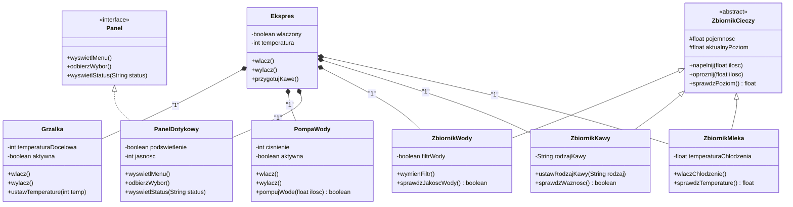

```mermaid
classDiagram
    %% Klasa główna ekspresu
    class Ekspres {
        -boolean wlaczony
        -int temperatura
        +wlacz()
        +wylacz()
        +przygotujKawe()
    }

    %% Grzałka
    class Grzalka {
        -int temperaturaDocelowa
        -boolean aktywna
        +wlacz()
        +wylacz()
        +ustawTemperature(int temp)
    }

    %% Klasa abstrakcyjna zbiorników
    class ZbiornikCieczy {
        <<abstract>>
        #float pojemnosc
        #float aktualnyPoziom
        +napelnij(float ilosc)
        +oproznij(float ilosc)
        +sprawdzPoziom() float
    }

    %% Zbiorniki konkretne
    class ZbiornikWody {
        -boolean filtrWody
        +wymienFiltr()
        +sprawdzJakoscWody() boolean
    }

    class ZbiornikKawy {
        -String rodzajKawy
        +ustawRodzajKawy(String rodzaj)
        +sprawdzWaznosc() boolean
    }

    class ZbiornikMleka {
        -float temperaturaChłodzenia
        +wlaczChlodzenie()
        +sprawdzTemperature() float
    }

    %% Pompa wody
    class PompaWody {
        -int cisnienie
        -boolean aktywna
        +wlacz()
        +wylacz()
        +pompujWode(float ilosc) boolean
    }

    %% Interfejs panelu
    class Panel {
        <<interface>>
        +wyswietlMenu()
        +odbierzWybor()
        +wyswietlStatus(String status)
    }

    %% Panel dotykowy
    class PanelDotykowy {
        -boolean podswietlenie
        -int jasnosc
        +wyswietlMenu()
        +odbierzWybor()
        +wyswietlStatus(String status)
    }

    %% Relacje dziedziczenia
    ZbiornikCieczy <|-- ZbiornikWody
    ZbiornikCieczy <|-- ZbiornikKawy
    ZbiornikCieczy <|-- ZbiornikMleka

    %% Implementacja interfejsu
    Panel <|.. PanelDotykowy

    %% Kompozycja - Ekspres zawiera komponenty
    Ekspres *-- Grzalka : "1"
    Ekspres *-- PompaWody : "1"
    Ekspres *-- PanelDotykowy : "1"
    Ekspres *-- ZbiornikWody : "1"
    Ekspres *-- ZbiornikKawy : "1"
    Ekspres *-- ZbiornikMleka : "1"
```
