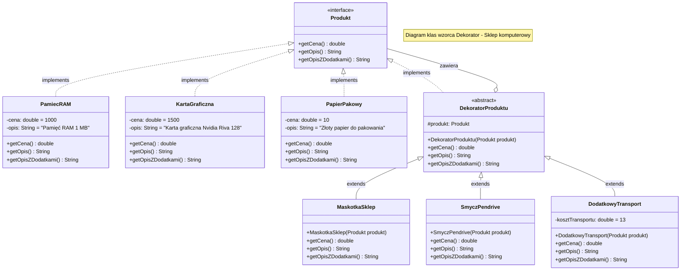

# Diagram klas wzorca Dekorator

## Opis wzorca Dekorator

Wzorzec **Dekorator** (ang. Decorator) jest strukturalnym wzorcem projektowym, który pozwala dynamicznie dodawać nowe zachowania do obiektów poprzez umieszczanie ich w specjalnych obiektach opakowujących (dekoratorach).

### Elementy wzorca:

1. **Produkt (Component)** - interfejs definiujący wspólne operacje dla obiektów bazowych i dekoratorów
2. **Konkretne produkty (Concrete Components)** - klasy implementujące interfejs Produkt (PamiecRAM, KartaGraficzna, PapierPakowy)
3. **DekoratorProduktu (Decorator)** - abstrakcyjna klasa bazowa dla wszystkich dekoratorów, przechowuje referencję do dekorowanego obiektu
4. **Konkretne dekoratory (Concrete Decorators)** - klasy dodające nowe funkcjonalności (MaskotkaSklep, SmyczPendrive, DodatkowyTransport)

### Zalety:

- Możliwość dynamicznego dodawania funkcjonalności bez modyfikacji istniejącego kodu
- Zgodność z zasadą otwarte-zamknięte (Open/Closed Principle)
- Możliwość łączenia wielu dekoratorów w dowolnej kolejności
