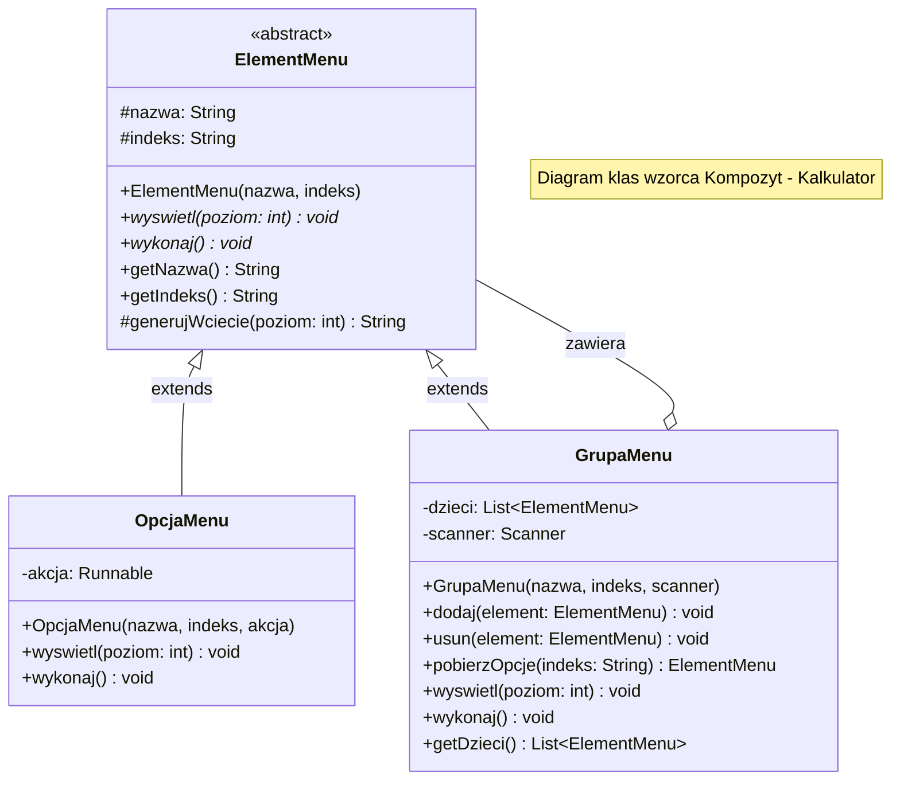
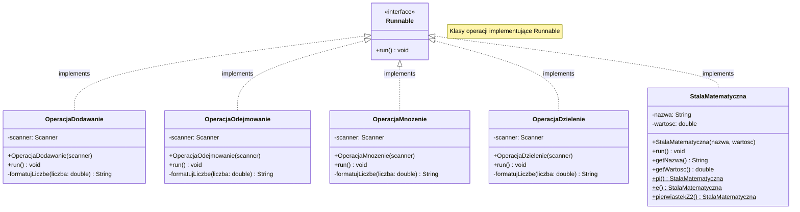

# Wzorzec Kompozyt - Kalkulator

## Diagram struktury wzorca



## Diagram klas operacji



## Struktura menu kalkulatora

```
GrupaMenu: "Kalkulator" (główne)
├── GrupaMenu: "Operacje" [1]
│   ├── OpcjaMenu: "Dodawanie" [a] → OperacjaDodawanie
│   ├── OpcjaMenu: "Odejmowanie" [b] → OperacjaOdejmowanie
│   ├── OpcjaMenu: "Mnożenie" [c] → OperacjaMnozenie
│   └── OpcjaMenu: "Dzielenie" [d] → OperacjaDzielenie
│
└── GrupaMenu: "Stałe" [2]
    ├── OpcjaMenu: "Pi" [a] → StalaMatematyczna.pi()
    ├── OpcjaMenu: "e" [b] → StalaMatematyczna.e()
    └── OpcjaMenu: "pierwiastek z 2" [c] → StalaMatematyczna.pierwiastekZ2()
```

## Zalety wzorca Kompozyt w tym rozwiązaniu

1. **Jednolity interfejs** - zarówno pojedyncze opcje jak i grupy są traktowane tak samo
2. **Łatwa rozbudowa** - dodanie nowej operacji wymaga tylko utworzenia nowej klasy i dodania do menu
3. **Rekurencyjna struktura** - menu może mieć dowolną głębokość zagnieżdżenia
4. **Separacja odpowiedzialności** - każda klasa ma jedną odpowiedzialność

## Przykład użycia

```
=== KALKULATOR ===
1. Operacje
2. Stałe
0. Wyjście
> 1

=== OPERACJE ===
a) Dodawanie
b) Odejmowanie
c) Mnożenie
d) Dzielenie
0. Powrót
> a

=== DODAWANIE ===
Podaj pierwszą liczbę: 5
Podaj drugą liczbę: 3
Wynik: 5 + 3 = 8
```

## Uruchomienie programu

```bash
cd src
javac zad05/*.java
java zad05.Main
```
