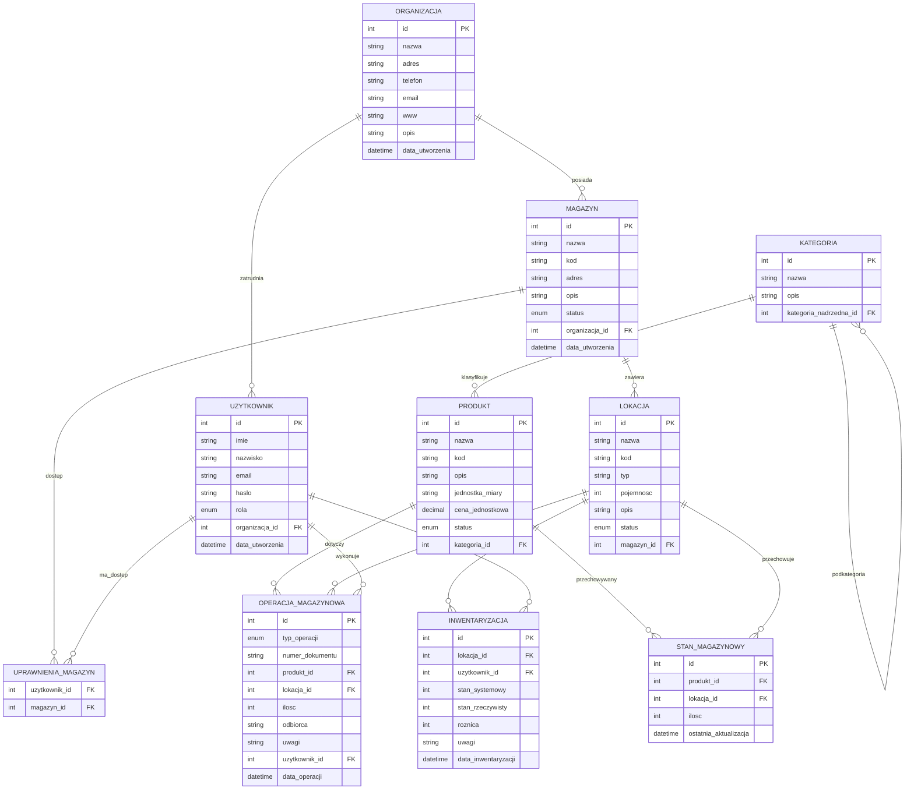
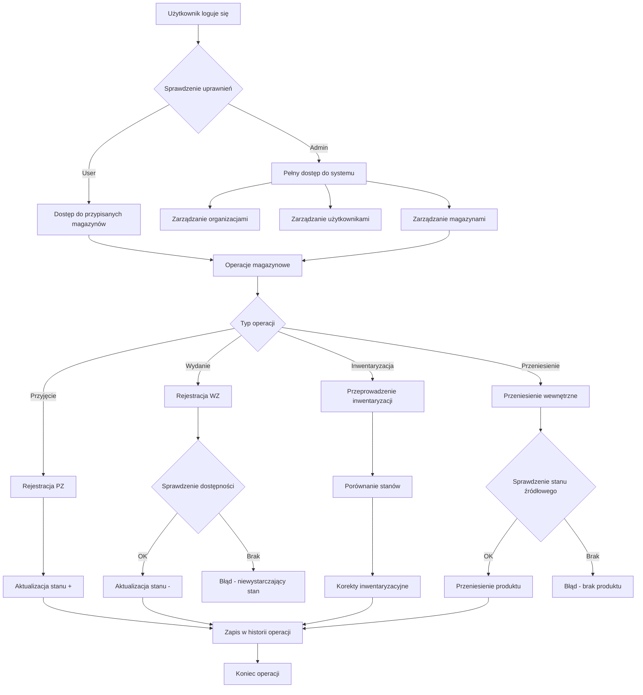
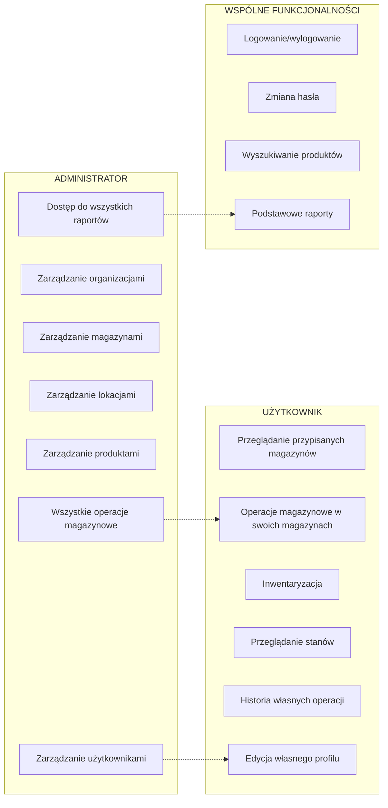
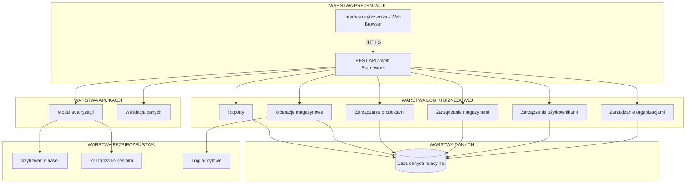

# Diagram Architektury Systemu Zarządzania Magazynami

## Diagram Struktury Danych

```mermaid
erDiagram
    ORGANIZACJA {
        int id PK
        string nazwa
        string adres
        string telefon
        string email
        string www
        string opis
        datetime data_utworzenia
    }

    UZYTKOWNIK {
        int id PK
        string imie
        string nazwisko
        string email
        string haslo
        enum rola
        int organizacja_id FK
        datetime data_utworzenia
    }

    MAGAZYN {
        int id PK
        string nazwa
        string kod
        string adres
        string opis
        enum status
        int organizacja_id FK
        datetime data_utworzenia
    }

    LOKACJA {
        int id PK
        string nazwa
        string kod
        string typ
        int pojemnosc
        string opis
        enum status
        int magazyn_id FK
    }

    KATEGORIA {
        int id PK
        string nazwa
        string opis
        int kategoria_nadrzedna_id FK
    }

    PRODUKT {
        int id PK
        string nazwa
        string kod
        string opis
        string jednostka_miary
        decimal cena_jednostkowa
        enum status
        int kategoria_id FK
    }

    STAN_MAGAZYNOWY {
        int id PK
        int produkt_id FK
        int lokacja_id FK
        int ilosc
        datetime ostatnia_aktualizacja
    }

    OPERACJA_MAGAZYNOWA {
        int id PK
        enum typ_operacji
        string numer_dokumentu
        int produkt_id FK
        int lokacja_id FK
        int ilosc
        string odbiorca
        string uwagi
        int uzytkownik_id FK
        datetime data_operacji
    }

    INWENTARYZACJA {
        int id PK
        int lokacja_id FK
        int uzytkownik_id FK
        int stan_systemowy
        int stan_rzeczywisty
        int roznica
        string uwagi
        datetime data_inwentaryzacji
    }

    UPRAWNIENIA_MAGAZYN {
        int uzytkownik_id FK
        int magazyn_id FK
    }

    ORGANIZACJA ||--o{ UZYTKOWNIK : "zatrudnia"
    ORGANIZACJA ||--o{ MAGAZYN : "posiada"
    MAGAZYN ||--o{ LOKACJA : "zawiera"
    MAGAZYN ||--o{ UPRAWNIENIA_MAGAZYN : "dostep"
    UZYTKOWNIK ||--o{ UPRAWNIENIA_MAGAZYN : "ma_dostep"
    KATEGORIA ||--o{ KATEGORIA : "podkategoria"
    KATEGORIA ||--o{ PRODUKT : "klasyfikuje"
    PRODUKT ||--o{ STAN_MAGAZYNOWY : "przechowywany"
    LOKACJA ||--o{ STAN_MAGAZYNOWY : "przechowuje"
    PRODUKT ||--o{ OPERACJA_MAGAZYNOWA : "dotyczy"
    LOKACJA ||--o{ OPERACJA_MAGAZYNOWA : "w_lokacji"
    UZYTKOWNIK ||--o{ OPERACJA_MAGAZYNOWA : "wykonuje"
    LOKACJA ||--o{ INWENTARYZACJA : "inwentaryzowana"
    UZYTKOWNIK ||--o{ INWENTARYZACJA : "przeprowadza"
```

## Diagram Przepływu Operacji Magazynowych

```mermaid
flowchart TD
    A[Użytkownik loguje się] --> B{Sprawdzenie uprawnień}
    B -->|Admin| C[Pełny dostęp do systemu]
    B -->|User| D[Dostęp do przypisanych magazynów]

    C --> E[Zarządzanie organizacjami]
    C --> F[Zarządzanie użytkownikami]
    C --> G[Zarządzanie magazynami]

    D --> H[Operacje magazynowe]
    G --> H

    H --> I{Typ operacji}
    I -->|Przyjęcie| J[Rejestracja PZ]
    I -->|Wydanie| K[Rejestracja WZ]
    I -->|Inwentaryzacja| L[Przeprowadzenie inwentaryzacji]
    I -->|Przeniesienie| M[Przeniesienie wewnętrzne]

    J --> N[Aktualizacja stanu +]
    K --> O{Sprawdzenie dostępności}
    O -->|OK| P[Aktualizacja stanu -]
    O -->|Brak| Q[Błąd - niewystarczający stan]

    L --> R[Porównanie stanów]
    R --> S[Korekty inwentaryzacyjne]

    M --> T{Sprawdzenie stanu źródłowego}
    T -->|OK| U[Przeniesienie produktu]
    T -->|Brak| V[Błąd - brak produktu]

    N --> W[Zapis w historii operacji]
    P --> W
    S --> W
    U --> W
    W --> X[Koniec operacji]
```

## Diagram Ról i Uprawnień

```mermaid
flowchart LR
    subgraph "ADMINISTRATOR"
        A1[Zarządzanie użytkownikami]
        A2[Zarządzanie organizacjami]
        A3[Zarządzanie magazynami]
        A4[Zarządzanie lokacjami]
        A5[Zarządzanie produktami]
        A6[Wszystkie operacje magazynowe]
        A7[Dostęp do wszystkich raportów]
    end

    subgraph "UŻYTKOWNIK"
        U1[Przeglądanie przypisanych magazynów]
        U2[Operacje magazynowe w swoich magazynach]
        U3[Inwentaryzacja]
        U4[Przeglądanie stanów]
        U5[Historia własnych operacji]
        U6[Edycja własnego profilu]
    end

    subgraph "WSPÓLNE FUNKCJONALNOŚCI"
        W1[Logowanie/wylogowanie]
        W2[Zmiana hasła]
        W3[Wyszukiwanie produktów]
        W4[Podstawowe raporty]
    end

    A1 -.-> U6
    A6 -.-> U2
    A7 -.-> W4
```

## Diagram Architektury Technicznej

```mermaid
flowchart TB
    subgraph "WARSTWA PREZENTACJI"
        UI[Interfejs użytkownika - Web Browser]
        UI --> |HTTPS| API
    end

    subgraph "WARSTWA APLIKACJI"
        API[REST API / Web Framework]
        AUTH[Moduł autoryzacji]
        VALID[Walidacja danych]

        API --> AUTH
        API --> VALID
    end

    subgraph "WARSTWA LOGIKI BIZNESOWEJ"
        ORG[Zarządzanie organizacjami]
        USER[Zarządzanie użytkownikami]
        WAREHOUSE[Zarządzanie magazynami]
        PRODUCT[Zarządzanie produktami]
        OPERATIONS[Operacje magazynowe]
        REPORTS[Raporty]

        API --> ORG
        API --> USER
        API --> WAREHOUSE
        API --> PRODUCT
        API --> OPERATIONS
        API --> REPORTS
    end

    subgraph "WARSTWA DANYCH"
        DB[(Baza danych relacyjna)]

        ORG --> DB
        USER --> DB
        WAREHOUSE --> DB
        PRODUCT --> DB
        OPERATIONS --> DB
        REPORTS --> DB
    end

    subgraph "WARSTWA BEZPIECZEŃSTWA"
        ENCRYPT[Szyfrowanie haseł]
        SESSION[Zarządzanie sesjami]
        AUDIT[Logi audytowe]

        AUTH --> ENCRYPT
        AUTH --> SESSION
        OPERATIONS --> AUDIT
    end
```
