# Diagram Use-Case - System Zarządzania Magazynami

## Opis Diagramu

Diagram przedstawia główne przypadki użycia systemu zarządzania magazynami na poziomie studenckim. System obsługuje dwie główne role użytkowników: Administrator z pełnymi uprawnieniami oraz Użytkownik z ograniczonym dostępem do operacji magazynowych.

## Aktorzy

- **Administrator** - pełny dostęp do wszystkich funkcjonalności systemu
- **Użytkownik** - dostęp do operacji magazynowych w przypisanych magazynach

## Diagram Use-Case

```mermaid
flowchart TB
    %% Aktorzy
    Admin[Administrator]
    User[Użytkownik]

    %% Zarządzanie Systemem - tylko Administrator
    subgraph "Zarządzanie Systemem"
        UC01[Zarządzanie użytkownikami]
        UC02[Zarządzanie organizacjami]
        UC03[Zarządzanie magazynami]
        UC04[Zarządzanie lokacjami]
        UC05[Zarządzanie produktami]
        UC06[Zarządzanie kategoriami]
    end

    %% Operacje Magazynowe - Administrator i Użytkownik
    subgraph "Operacje Magazynowe"
        UC07[Przyjęcie towaru - PZ]
        UC08[Wydanie towaru - WZ]
        UC09[Inwentaryzacja]
        UC10[Przeniesienie wewnętrzne]
        UC11[Aktualizacja stanów]
    end

    %% Przeglądanie i Wyszukiwanie - Administrator i Użytkownik
    subgraph "Przeglądanie i Wyszukiwanie"
        UC12[Wyszukiwanie produktów]
        UC13[Przeglądanie stanów magazynowych]
        UC14[Przeglądanie lokacji]
        UC15[Przeglądanie historii operacji]
    end

    %% Raportowanie - Administrator i Użytkownik
    subgraph "Raportowanie"
        UC16[Generowanie raportów stanów]
        UC17[Raport operacji w okresie]
        UC18[Raport inwentaryzacji]
        UC19[Lista produktów o niskich stanach]
    end

    %% Zarządzanie Kontem - Administrator i Użytkownik
    subgraph "Zarządzanie Kontem"
        UC20[Logowanie do systemu]
        UC21[Zmiana hasła]
        UC22[Edycja własnego profilu]
        UC23[Wylogowanie z systemu]
    end

    %% Funkcje pomocnicze
    subgraph "Funkcje Pomocnicze"
        UC24[Walidacja danych]
        UC25[Kontrola uprawnień]
        UC26[Logowanie operacji]
    end

    %% Relacje Administrator
    Admin --> UC01
    Admin --> UC02
    Admin --> UC03
    Admin --> UC04
    Admin --> UC05
    Admin --> UC06
    Admin --> UC07
    Admin --> UC08
    Admin --> UC09
    Admin --> UC10
    Admin --> UC12
    Admin --> UC13
    Admin --> UC14
    Admin --> UC15
    Admin --> UC16
    Admin --> UC17
    Admin --> UC18
    Admin --> UC19
    Admin --> UC20
    Admin --> UC21
    Admin --> UC22
    Admin --> UC23

    %% Relacje Użytkownik
    User --> UC07
    User --> UC08
    User --> UC09
    User --> UC10
    User --> UC12
    User --> UC13
    User --> UC14
    User --> UC15
    User --> UC16
    User --> UC17
    User --> UC18
    User --> UC19
    User --> UC20
    User --> UC21
    User --> UC22
    User --> UC23

    %% Relacje include - funkcje pomocnicze używane przez inne UC
    UC01 -.->|include| UC24
    UC02 -.->|include| UC24
    UC03 -.->|include| UC24
    UC04 -.->|include| UC24
    UC05 -.->|include| UC24
    UC07 -.->|include| UC24
    UC08 -.->|include| UC24
    UC09 -.->|include| UC24
    UC10 -.->|include| UC24

    UC01 -.->|include| UC25
    UC02 -.->|include| UC25
    UC03 -.->|include| UC25
    UC04 -.->|include| UC25
    UC05 -.->|include| UC25
    UC07 -.->|include| UC25
    UC08 -.->|include| UC25
    UC09 -.->|include| UC25
    UC10 -.->|include| UC25

    UC07 -.->|include| UC26
    UC08 -.->|include| UC26
    UC09 -.->|include| UC26
    UC10 -.->|include| UC26

    %% Relacje extend - rozszerzenia opcjonalne
    UC11 -.->|extend| UC07
    UC11 -.->|extend| UC08
    UC11 -.->|extend| UC09
    UC11 -.->|extend| UC10

    %% Stylowanie
    classDef adminOnly fill:#ffcccc
    classDef shared fill:#ccffcc
    classDef helper fill:#ccccff

    class UC01,UC02,UC03,UC04,UC05,UC06 adminOnly
    class UC07,UC08,UC09,UC10,UC12,UC13,UC14,UC15,UC16,UC17,UC18,UC19,UC20,UC21,UC22,UC23 shared
    class UC24,UC25,UC26,UC11 helper
```

## Opis Przypadków Użycia

### Zarządzanie Systemem (tylko Administrator)

- **UC01 - Zarządzanie użytkownikami**: Dodawanie, edycja, usuwanie użytkowników, przypisywanie do organizacji
- **UC02 - Zarządzanie organizacjami**: Tworzenie, edycja, usuwanie organizacji
- **UC03 - Zarządzanie magazynami**: Tworzenie magazynów, przypisywanie użytkowników
- **UC04 - Zarządzanie lokacjami**: Tworzenie lokacji w magazynach, definiowanie pojemności
- **UC05 - Zarządzanie produktami**: Dodawanie produktów, edycja danych produktów
- **UC06 - Zarządzanie kategoriami**: Tworzenie i zarządzanie kategoriami produktów

### Operacje Magazynowe (Administrator i Użytkownik)

- **UC07 - Przyjęcie towaru**: Rejestracja dokumentów PZ, zwiększanie stanów
- **UC08 - Wydanie towaru**: Rejestracja dokumentów WZ, zmniejszanie stanów
- **UC09 - Inwentaryzacja**: Przeprowadzanie inwentaryzacji, korekty stanów
- **UC10 - Przeniesienie wewnętrzne**: Przenoszenie produktów między lokacjami
- **UC11 - Aktualizacja stanów**: Automatyczna aktualizacja stanów magazynowych

### Przeglądanie i Wyszukiwanie (Administrator i Użytkownik)

- **UC12 - Wyszukiwanie produktów**: Wyszukiwanie po nazwie, kodzie, kategorii
- **UC13 - Przeglądanie stanów**: Sprawdzanie aktualnych stanów magazynowych
- **UC14 - Przeglądanie lokacji**: Przeglądanie struktury magazynów i lokacji
- **UC15 - Przeglądanie historii**: Dostęp do historii operacji magazynowych

### Raportowanie (Administrator i Użytkownik)

- **UC16 - Raporty stanów**: Generowanie raportów aktualnych stanów
- **UC17 - Raport operacji**: Raporty operacji w określonym okresie
- **UC18 - Raport inwentaryzacji**: Raporty z przeprowadzonych inwentaryzacji
- **UC19 - Produkty o niskich stanach**: Lista produktów wymagających uzupełnienia

### Zarządzanie Kontem (Administrator i Użytkownik)

- **UC20 - Logowanie**: Uwierzytelnienie użytkownika w systemie
- **UC21 - Zmiana hasła**: Zmiana hasła dostępu do systemu
- **UC22 - Edycja profilu**: Aktualizacja danych osobowych
- **UC23 - Wylogowanie**: Zakończenie sesji użytkownika

### Funkcje Pomocnicze

- **UC24 - Walidacja danych**: Sprawdzanie poprawności wprowadzanych danych
- **UC25 - Kontrola uprawnień**: Weryfikacja uprawnień użytkownika do operacji
- **UC26 - Logowanie operacji**: Rejestrowanie wykonanych operacji w systemie

## Relacje między Przypadkami Użycia

### Relacje Include

- Wszystkie operacje CRUD zawierają walidację danych
- Wszystkie operacje wymagają kontroli uprawnień
- Operacje magazynowe zawierają logowanie operacji

### Relacje Extend

- Aktualizacja stanów rozszerza operacje magazynowe jako automatyczna funkcjonalność

## Legenda Kolorów

- 🔴 **Czerwony** - Funkcjonalności dostępne tylko dla Administratora
- 🟢 **Zielony** - Funkcjonalności dostępne dla obu ról
- 🔵 **Niebieski** - Funkcje pomocnicze i rozszerzenia
