# Lab01 - Program Modeling Diagrams

This document presents comprehensive modeling diagrams for all four tasks in Lab01, showcasing different architectural patterns and design approaches in Java programming.

1. [Lab01 - Program Modeling Diagrams](#lab01---program-modeling-diagrams)
   1. [Task 1: Basic Fraction Class](#task-1-basic-fraction-class)
      1. [Architecture Overview](#architecture-overview)
      2. [UML Class Diagram](#uml-class-diagram)
      3. [Data Flow Diagram](#data-flow-diagram)
      4. [Design Patterns Used](#design-patterns-used)
   2. [Task 2: Extended Fraction Class](#task-2-extended-fraction-class)
      1. [Architecture Overview](#architecture-overview-1)
      2. [UML Class Diagram](#uml-class-diagram-1)
      3. [State Diagram for Fraction Forms](#state-diagram-for-fraction-forms)
      4. [Conversion Flow Diagram](#conversion-flow-diagram)
      5. [Design Patterns Used](#design-patterns-used-1)
   3. [Task 3: Rectangle and RectangleCollection](#task-3-rectangle-and-rectanglecollection)
      1. [Architecture Overview](#architecture-overview-2)
      2. [UML Class Diagram](#uml-class-diagram-2)
      3. [Composition Relationship Diagram](#composition-relationship-diagram)
      4. [CRUD Operations Flow](#crud-operations-flow)
      5. [Design Patterns Used](#design-patterns-used-2)
   4. [Task 4: Shape Hierarchy with Polymorphism](#task-4-shape-hierarchy-with-polymorphism)
      1. [Architecture Overview](#architecture-overview-3)
      2. [UML Class Diagram](#uml-class-diagram-3)
      3. [Interface Implementation Diagram](#interface-implementation-diagram)
      4. [Polymorphism in Action Diagram](#polymorphism-in-action-diagram)
      5. [Design Patterns Used](#design-patterns-used-3)
   5. [Summary of Architectural Patterns](#summary-of-architectural-patterns)

## Task 1: Basic Fraction Class

### Architecture Overview

Task 1 implements a simple immutable fraction class with basic mathematical operations. The design follows the **Value Object** pattern, ensuring immutability and proper encapsulation.

### UML Class Diagram

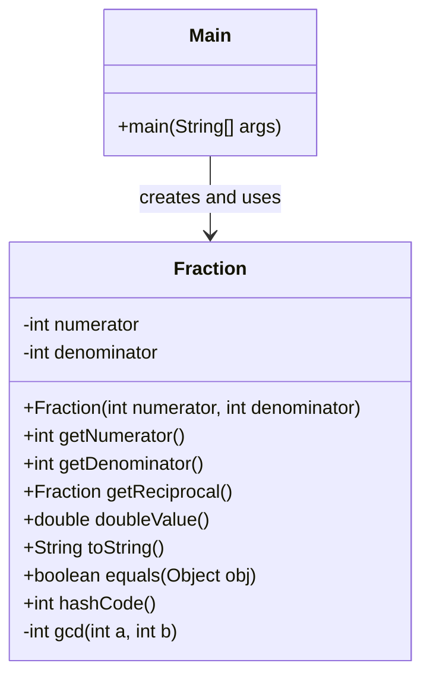

### Data Flow Diagram

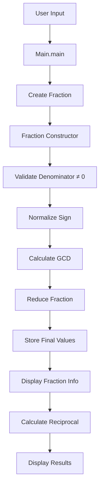

### Design Patterns Used

- **Value Object Pattern**: Immutable fraction representation
- **Factory Method Pattern**: Constructor acts as factory for creating valid fractions
- **Template Method Pattern**: Common validation and normalization steps

---

## Task 2: Extended Fraction Class

### Architecture Overview

Task 2 extends the fraction concept to support mixed fractions with multiple constructors and conversion methods. It demonstrates **Constructor Overloading** and **Static Factory Methods** patterns.

### UML Class Diagram

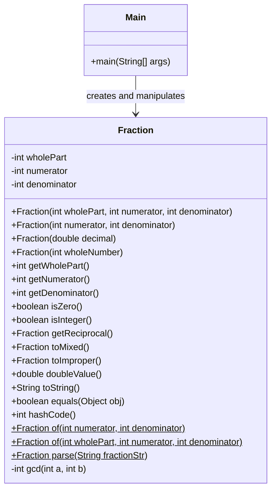

### State Diagram for Fraction Forms

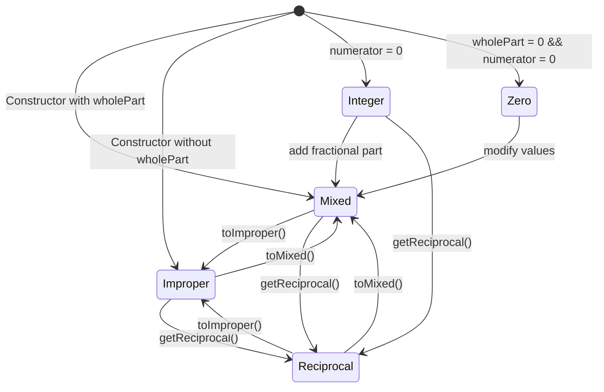

### Conversion Flow Diagram

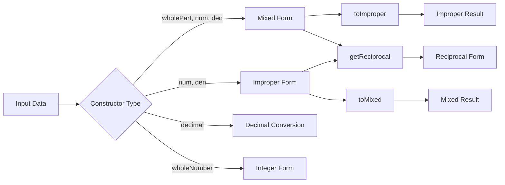

### Design Patterns Used

- **Builder Pattern**: Multiple constructors for different initialization scenarios
- **Static Factory Methods**: `of()` and `parse()` methods
- **State Pattern**: Different fraction representations (mixed, improper, integer)
- **Strategy Pattern**: Different conversion strategies

---

## Task 3: Rectangle and RectangleCollection

### Architecture Overview

Task 3 implements a **Composition Pattern** where `Main` class uses `RectangleCollection` to manage multiple `Rectangle` objects. This demonstrates separation of concerns and encapsulation of collection operations.

### UML Class Diagram

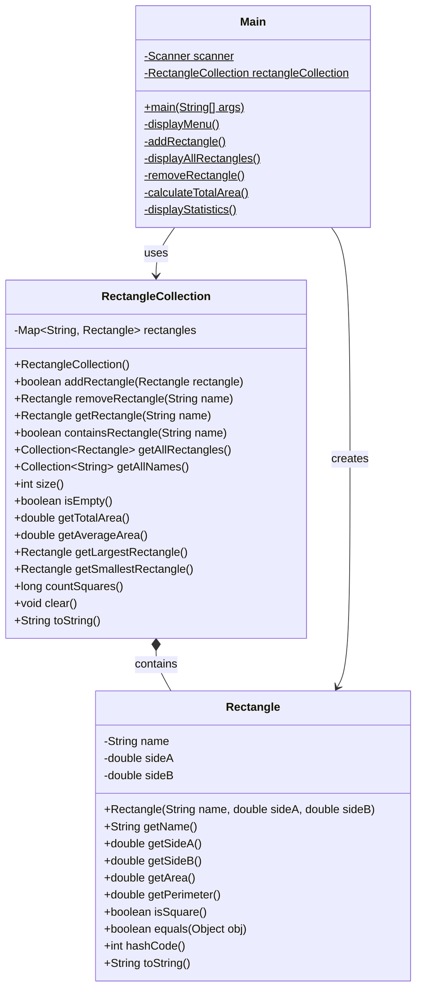

### Composition Relationship Diagram

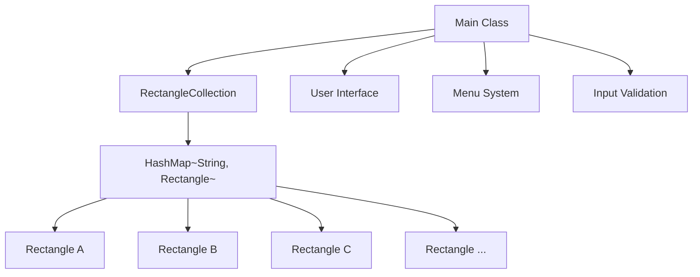

### CRUD Operations Flow

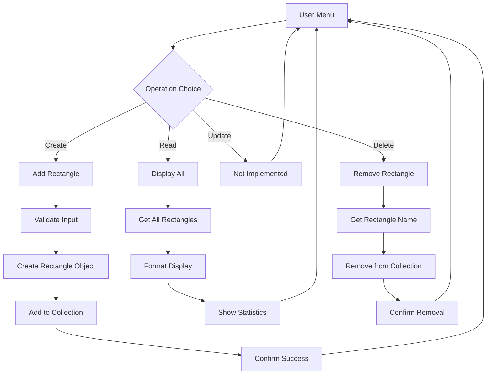

### Design Patterns Used

- **Composition Pattern**: Main uses RectangleCollection
- **Collection Pattern**: Encapsulated rectangle management
- **Command Pattern**: Menu-driven operations
- **Repository Pattern**: RectangleCollection acts as repository

---

## Task 4: Shape Hierarchy with Polymorphism

### Architecture Overview

Task 4 demonstrates **Interface-based Polymorphism** with the `Shape` interface implemented by `Rectangle` and `Square` classes. This showcases the **Strategy Pattern** and **Polymorphic Behavior**.

### UML Class Diagram

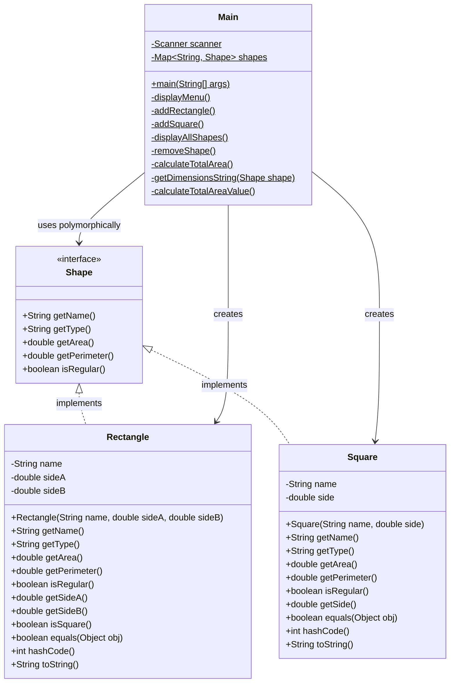

### Interface Implementation Diagram

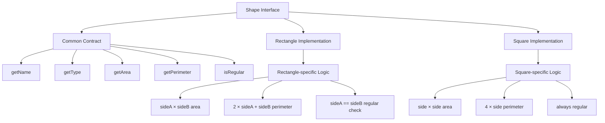

### Polymorphism in Action Diagram

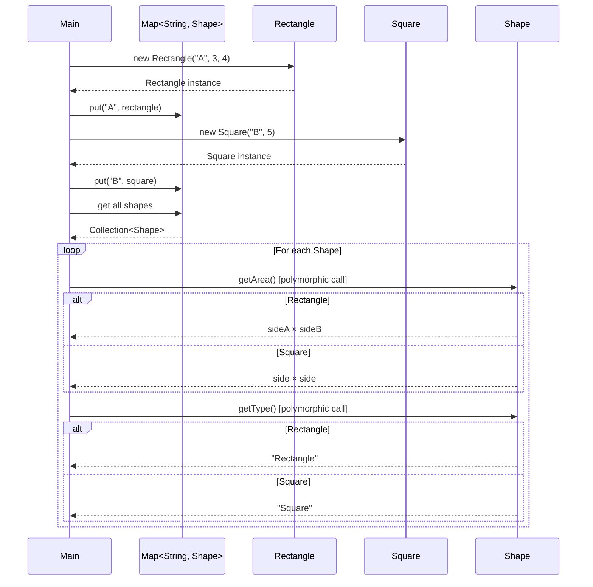

### Design Patterns Used

- **Strategy Pattern**: Different area/perimeter calculation strategies
- **Template Method Pattern**: Common interface with specific implementations
- **Polymorphism**: Runtime method resolution
- **Factory Pattern**: Object creation in Main class

---

## Summary of Architectural Patterns

| Task       | Primary Patterns                        | Key Concepts                                 |
| ---------- | --------------------------------------- | -------------------------------------------- |
| **Task 1** | Value Object, Factory Method            | Immutability, Encapsulation                  |
| **Task 2** | Builder, Static Factory, State          | Multiple constructors, State transitions     |
| **Task 3** | Composition, Repository, Command        | Object composition, Collection management    |
| **Task 4** | Strategy, Polymorphism, Template Method | Interface-based design, Runtime polymorphism |
