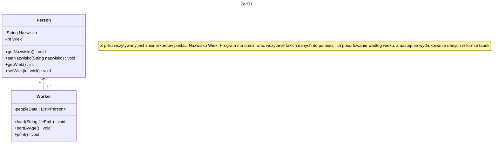

```mermaid
---
title: Zad01
---
classDiagram
    note "Z pliku wczytywany jest zbiór rekordów postaci Nazwisko Wiek. Program ma umożliwiać wczytanie takich danych do pamięci, ich posortowanie według wieku, a następnie wydrukowanie danych w formie tabeli"

    class Person {
        -String Nazwisko
        -int Wiek
        +getNazwisko() void
        +setNazwisko(String nazwisko) void
        +getWiek() int
        +setWiek(int wiek) void
    }

    class Worker {
        -peopleData : List~Person~
        +load(String filePath) void
        +sortByAge() void
        +print() void
    }

    Person "1" <-- "1..*" Worker
```
