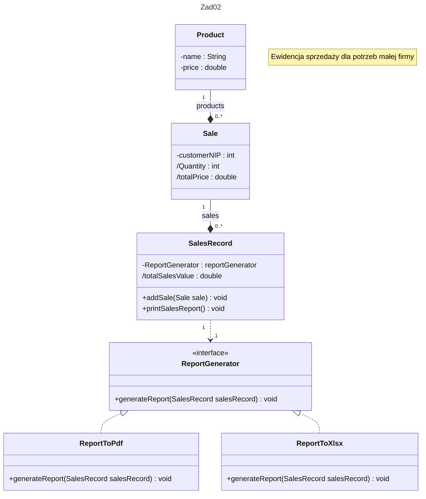

```mermaid
---
title: Zad02
---
classDiagram
    note "Ewidencja sprzedaży dla potrzeb małej firmy"

    class Product {
        -name : String
        -price : double
    }

    class Sale {
        -customerNIP : int
        /Quantity : int
        /totalPrice : double
    }

    class SalesRecord {
        -ReportGenerator : reportGenerator
        /totalSalesValue : double
        +addSale(Sale sale) void
        +printSalesReport() void
    }

    class ReportGenerator {
        <<interface>>
        +generateReport(SalesRecord salesRecord) void
    }

    class ReportToPdf {
        +generateReport(SalesRecord salesRecord) void
    }

    class ReportToXlsx {
        +generateReport(SalesRecord salesRecord) void
    }

    Product "1" --* "0..*" Sale: products
    Sale "1" --* "0..*" SalesRecord: sales
    SalesRecord "1" ..> "1" ReportGenerator
    ReportGenerator <|.. ReportToPdf
    ReportGenerator <|.. ReportToXlsx
```
