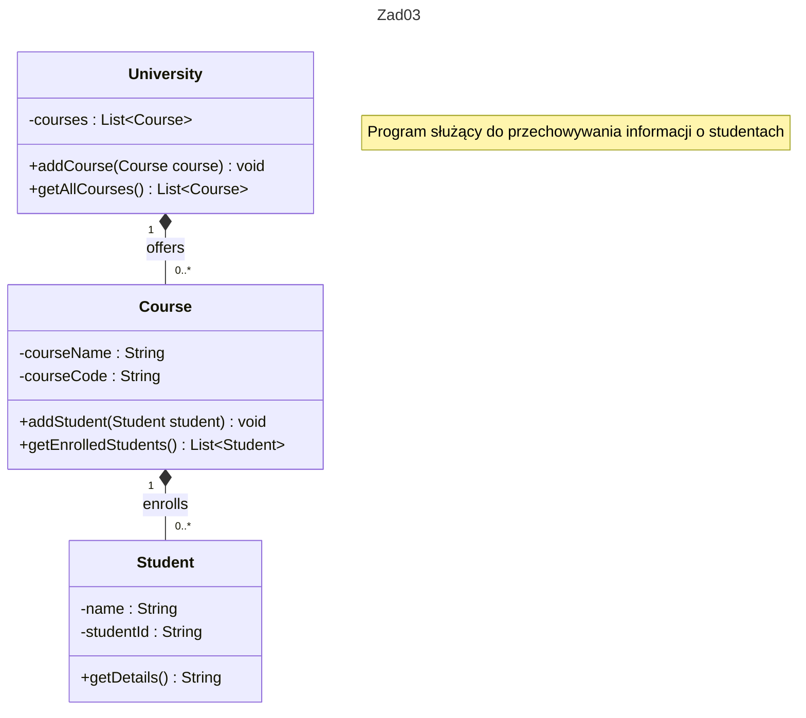

```mermaid
---
title: Zad03
---
classDiagram
    note "Program służący do przechowywania informacji o studentach"

    class Student {
        -name : String
        -studentId : String
        +getDetails() String
    }

    class Course {
        -courseName : String
        -courseCode : String
        +addStudent(Student student) void
        +getEnrolledStudents() List~Student~
    }

    class University {
        -courses : List~Course~
        +addCourse(Course course) void
        +getAllCourses() List~Course~
    }

    University "1" *-- "0..*" Course: offers
    Course "1" *-- "0..*" Student: enrolls
```
