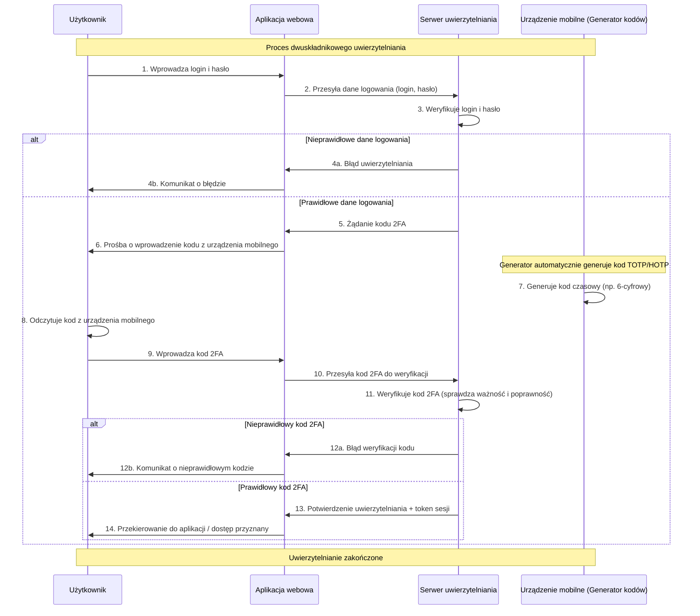

# Diagram komunikacji - Dwuskładnikowe uwierzytelnianie (2FA)

```mermaid
sequenceDiagram
    participant U as Użytkownik
    participant A as Aplikacja webowa
    participant S as Serwer uwierzytelniania
    participant M as Urządzenie mobilne (Generator kodów)

    Note over U,M: Proces dwuskładnikowego uwierzytelniania

    %% Krok 1: Wprowadzenie danych logowania
    U->>A: 1. Wprowadza login i hasło
    A->>S: 2. Przesyła dane logowania (login, hasło)

    %% Krok 2: Weryfikacja pierwszego składnika
    S->>S: 3. Weryfikuje login i hasło

    alt Nieprawidłowe dane logowania
        S->>A: 4a. Błąd uwierzytelniania
        A->>U: 4b. Komunikat o błędzie
    else Prawidłowe dane logowania
        %% Krok 3: Żądanie drugiego składnika
        S->>A: 5. Żądanie kodu 2FA
        A->>U: 6. Prośba o wprowadzenie kodu z urządzenia mobilnego

        %% Krok 4: Generowanie kodu na urządzeniu mobilnym
        Note over M: Generator automatycznie generuje kod TOTP/HOTP
        M->>M: 7. Generuje kod czasowy (np. 6-cyfrowy)

        %% Krok 5: Wprowadzenie kodu przez użytkownika
        U->>U: 8. Odczytuje kod z urządzenia mobilnego
        U->>A: 9. Wprowadza kod 2FA
        A->>S: 10. Przesyła kod 2FA do weryfikacji

        %% Krok 6: Weryfikacja kodu
        S->>S: 11. Weryfikuje kod 2FA (sprawdza ważność i poprawność)

        alt Nieprawidłowy kod 2FA
            S->>A: 12a. Błąd weryfikacji kodu
            A->>U: 12b. Komunikat o nieprawidłowym kodzie
        else Prawidłowy kod 2FA
            %% Krok 7: Potwierdzenie uwierzytelniania
            S->>A: 13. Potwierdzenie uwierzytelniania + token sesji
            A->>U: 14. Przekierowanie do aplikacji / dostęp przyznany
        end
    end

    Note over U,M: Uwierzytelnianie zakończone
```
