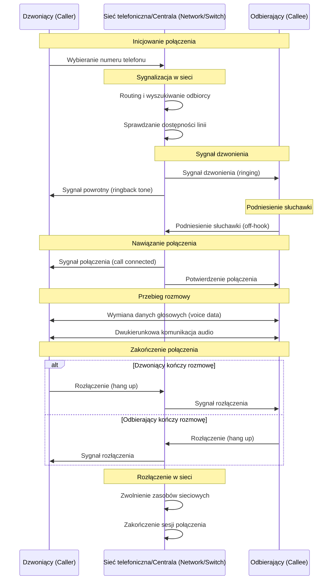

# Diagram komunikacji - Typowa rozmowa telefoniczna

```mermaid
sequenceDiagram
    participant C as Dzwoniący (Caller)
    participant N as Sieć telefoniczna/Centrala (Network/Switch)
    participant R as Odbierający (Callee)

    Note over C,R: Inicjowanie połączenia
    C->>N: Wybieranie numeru telefonu

    Note over N: Sygnalizacja w sieci
    N->>N: Routing i wyszukiwanie odbiorcy
    N->>N: Sprawdzanie dostępności linii

    Note over N,R: Sygnał dzwonienia
    N->>R: Sygnał dzwonienia (ringing)
    N->>C: Sygnał powrotny (ringback tone)

    Note over R: Podniesienie słuchawki
    R->>N: Podniesienie słuchawki (off-hook)

    Note over C,R: Nawiązanie połączenia
    N->>C: Sygnał połączenia (call connected)
    N->>R: Potwierdzenie połączenia

    Note over C,R: Przebieg rozmowy
    C<<->>R: Wymiana danych głosowych (voice data)
    C<<->>R: Dwukierunkowa komunikacja audio

    Note over C,R: Zakończenie połączenia
    alt Dzwoniący kończy rozmowę
        C->>N: Rozłączenie (hang up)
        N->>R: Sygnał rozłączenia
    else Odbierający kończy rozmowę
        R->>N: Rozłączenie (hang up)
        N->>C: Sygnał rozłączenia
    end

    Note over N: Rozłączenie w sieci
    N->>N: Zwolnienie zasobów sieciowych
    N->>N: Zakończenie sesji połączenia
```
