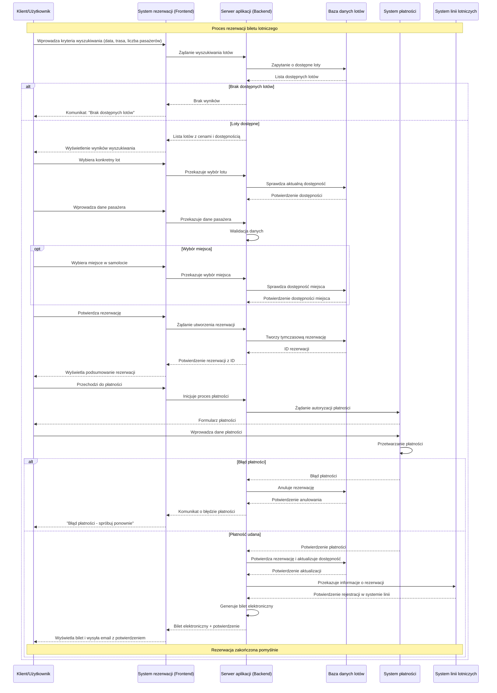

# Diagram komunikacji - System rezerwacji biletów lotniczych

```mermaid
sequenceDiagram
    participant K as Klient/Użytkownik
    participant S as System rezerwacji (Frontend)
    participant B as Serwer aplikacji (Backend)
    participant DB as Baza danych lotów
    participant P as System płatności
    participant L as System linii lotniczych

    Note over K,L: Proces rezerwacji biletu lotniczego

    %% Wyszukiwanie lotów
    K->>S: Wprowadza kryteria wyszukiwania (data, trasa, liczba pasażerów)
    S->>B: Żądanie wyszukiwania lotów
    B->>DB: Zapytanie o dostępne loty
    DB-->>B: Lista dostępnych lotów

    alt Brak dostępnych lotów
        B-->>S: Brak wyników
        S-->>K: Komunikat: "Brak dostępnych lotów"
    else Loty dostępne
        B-->>S: Lista lotów z cenami i dostępnością
        S-->>K: Wyświetlenie wyników wyszukiwania

        %% Wybór lotu
        K->>S: Wybiera konkretny lot
        S->>B: Przekazuje wybór lotu
        B->>DB: Sprawdza aktualną dostępność
        DB-->>B: Potwierdzenie dostępności

        %% Wprowadzenie danych pasażera
        K->>S: Wprowadza dane pasażera
        S->>B: Przekazuje dane pasażera
        B->>B: Walidacja danych

        %% Opcjonalny wybór miejsca
        opt Wybór miejsca
            K->>S: Wybiera miejsce w samolocie
            S->>B: Przekazuje wybór miejsca
            B->>DB: Sprawdza dostępność miejsca
            DB-->>B: Potwierdzenie dostępności miejsca
        end

        %% Potwierdzenie rezerwacji
        K->>S: Potwierdza rezerwację
        S->>B: Żądanie utworzenia rezerwacji
        B->>DB: Tworzy tymczasową rezerwację
        DB-->>B: ID rezerwacji
        B-->>S: Potwierdzenie rezerwacji z ID
        S-->>K: Wyświetla podsumowanie rezerwacji

        %% Proces płatności
        K->>S: Przechodzi do płatności
        S->>B: Inicjuje proces płatności
        B->>P: Żądanie autoryzacji płatności
        P-->>K: Formularz płatności
        K->>P: Wprowadza dane płatności
        P->>P: Przetwarzanie płatności

        alt Błąd płatności
            P-->>B: Błąd płatności
            B->>DB: Anuluje rezerwację
            DB-->>B: Potwierdzenie anulowania
            B-->>S: Komunikat o błędzie płatności
            S-->>K: "Błąd płatności - spróbuj ponownie"
        else Płatność udana
            P-->>B: Potwierdzenie płatności
            B->>DB: Potwierdza rezerwację i aktualizuje dostępność
            DB-->>B: Potwierdzenie aktualizacji

            %% Komunikacja z systemem linii lotniczych
            B->>L: Przekazuje informacje o rezerwacji
            L-->>B: Potwierdzenie rejestracji w systemie linii

            %% Generowanie biletu
            B->>B: Generuje bilet elektroniczny
            B-->>S: Bilet elektroniczny + potwierdzenie
            S-->>K: Wyświetla bilet i wysyła email z potwierdzeniem

            Note over K,L: Rezerwacja zakończona pomyślnie
        end
    end
```
