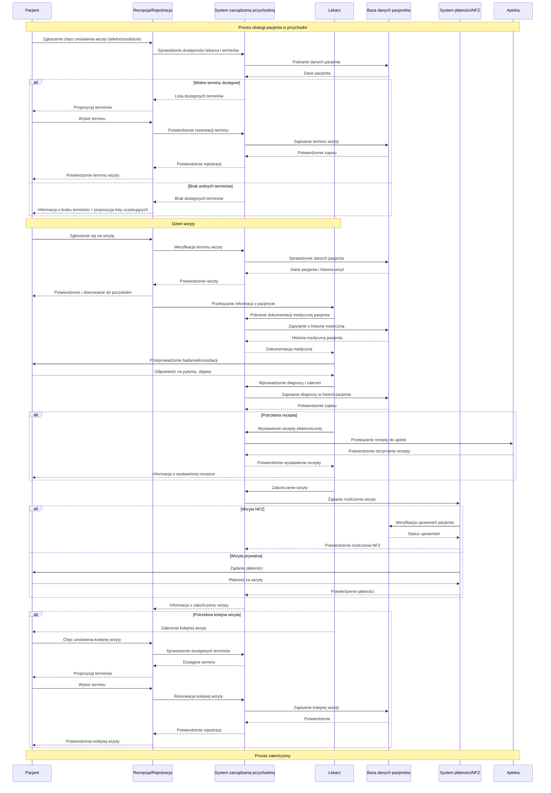

# Diagram komunikacji - System wspomagający pracę przychodni lekarskiej

```mermaid
sequenceDiagram
    participant P as Pacjent
    participant R as Recepcja/Rejestracja
    participant S as System zarządzania przychodnią
    participant L as Lekarz
    participant BD as Baza danych pacjentów
    participant SP as System płatności/NFZ
    participant A as Apteka

    Note over P,A: Proces obsługi pacjenta w przychodni

    %% Rejestracja wizyty
    P->>R: Zgłoszenie chęci umówienia wizyty (telefon/osobiście)
    R->>S: Sprawdzenie dostępności lekarza i terminów
    S->>BD: Pobranie danych pacjenta
    BD-->>S: Dane pacjenta

    alt Wolne terminy dostępne
        S-->>R: Lista dostępnych terminów
        R-->>P: Propozycja terminów
        P->>R: Wybór terminu
        R->>S: Potwierdzenie rezerwacji terminu
        S->>BD: Zapisanie terminu wizyty
        BD-->>S: Potwierdzenie zapisu
        S-->>R: Potwierdzenie rejestracji
        R-->>P: Potwierdzenie terminu wizyty
    else Brak wolnych terminów
        S-->>R: Brak dostępnych terminów
        R-->>P: Informacja o braku terminów + propozycja listy oczekujących
    end

    Note over P,L: Dzień wizyty

    %% Przyjście pacjenta na wizytę
    P->>R: Zgłoszenie się na wizytę
    R->>S: Weryfikacja terminu wizyty
    S->>BD: Sprawdzenie danych pacjenta
    BD-->>S: Dane pacjenta i historia wizyt
    S-->>R: Potwierdzenie wizyty
    R-->>P: Potwierdzenie i skierowanie do poczekalni

    %% Wizyta u lekarza
    R->>L: Przekazanie informacji o pacjencie
    L->>S: Pobranie dokumentacji medycznej pacjenta
    S->>BD: Zapytanie o historię medyczną
    BD-->>S: Historia medyczna pacjenta
    S-->>L: Dokumentacja medyczna

    L->>P: Przeprowadzenie badania/konsultacji
    P-->>L: Odpowiedzi na pytania, objawy

    %% Wprowadzenie diagnozy
    L->>S: Wprowadzenie diagnozy i zaleceń
    S->>BD: Zapisanie diagnozy w historii pacjenta
    BD-->>S: Potwierdzenie zapisu

    %% Wystawienie recepty (opcjonalnie)
    alt Potrzebna recepta
        L->>S: Wystawienie recepty elektronicznej
        S->>A: Przekazanie recepty do apteki
        A-->>S: Potwierdzenie otrzymania recepty
        S-->>L: Potwierdzenie wystawienia recepty
        L-->>P: Informacja o wystawionej recepcie
    end

    %% Rozliczenie wizyty
    L->>S: Zakończenie wizyty
    S->>SP: Żądanie rozliczenia wizyty

    alt Wizyta NFZ
        SP->>BD: Weryfikacja uprawnień pacjenta
        BD-->>SP: Status uprawnień
        SP-->>S: Potwierdzenie rozliczenia NFZ
    else Wizyta prywatna
        SP->>P: Żądanie płatności
        P-->>SP: Płatność za wizytę
        SP-->>S: Potwierdzenie płatności
    end

    S-->>R: Informacja o zakończeniu wizyty

    %% Umówienie kolejnej wizyty (opcjonalnie)
    alt Potrzebna kolejna wizyta
        L-->>P: Zalecenie kolejnej wizyty
        P->>R: Chęć umówienia kolejnej wizyty
        R->>S: Sprawdzenie dostępnych terminów
        S-->>R: Dostępne terminy
        R-->>P: Propozycja terminów
        P->>R: Wybór terminu
        R->>S: Rezerwacja kolejnej wizyty
        S->>BD: Zapisanie kolejnej wizyty
        BD-->>S: Potwierdzenie
        S-->>R: Potwierdzenie rejestracji
        R-->>P: Potwierdzenie kolejnej wizyty
    end

    Note over P,A: Proces zakończony
```
