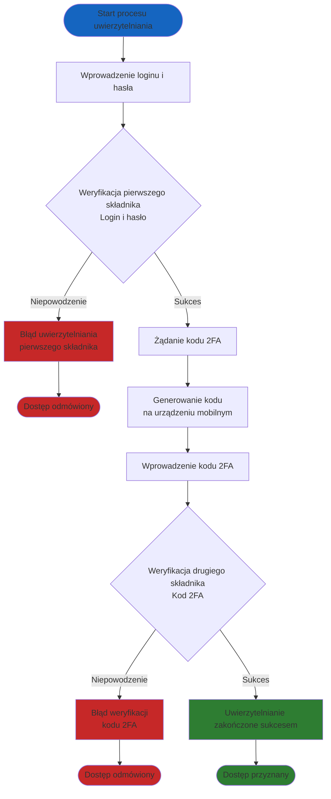

# Przeglądowy diagram interakcji - Dwuskładnikowe uwierzytelnianie

```mermaid
flowchart TD
    Start([Start procesu uwierzytelniania]) --> Login[Wprowadzenie loginu i hasła]

    Login --> Verify1{Weryfikacja pierwszego składnika<br/>Login i hasło}

    Verify1 -->|Niepowodzenie| Error1[Błąd uwierzytelniania<br/>pierwszego składnika]
    Error1 --> End1([Dostęp odmówiony])

    Verify1 -->|Sukces| Request2FA[Żądanie kodu 2FA]

    Request2FA --> Generate[Generowanie kodu<br/>na urządzeniu mobilnym]

    Generate --> Input2FA[Wprowadzenie kodu 2FA]

    Input2FA --> Verify2{Weryfikacja drugiego składnika<br/>Kod 2FA}

    Verify2 -->|Niepowodzenie| Error2[Błąd weryfikacji<br/>kodu 2FA]
    Error2 --> End2([Dostęp odmówiony])

    Verify2 -->|Sukces| Success[Uwierzytelnianie zakończone sukcesem]
    Success --> End3([Dostęp przyznany])

    style Start fill:#1565c0
    style End1 fill:#c62828
    style End2 fill:#c62828
    style End3 fill:#2e7d32
    style Error1 fill:#c62828
    style Error2 fill:#c62828
    style Success fill:#2e7d32
```
