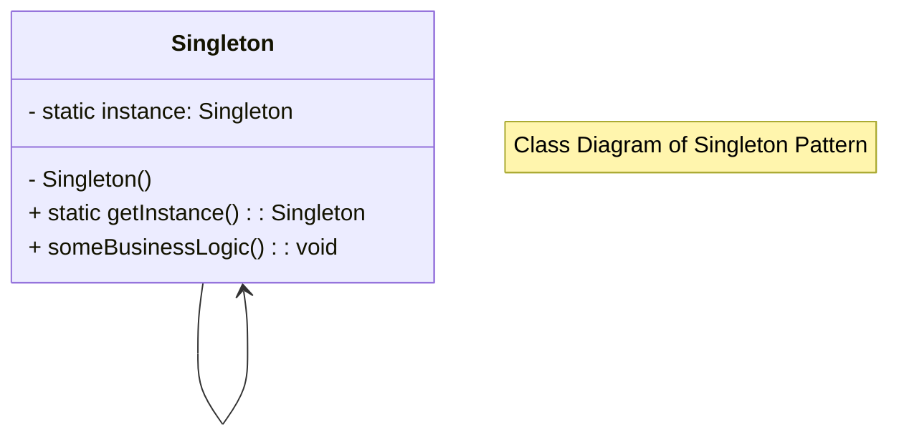

```mermaid
classDiagram
note "Class Diagram of Singleton Pattern"
    class Singleton {
        - static instance: Singleton
        - Singleton()
        + static getInstance(): Singleton
        + someBusinessLogic(): void
    }
    Singleton --> Singleton
```
